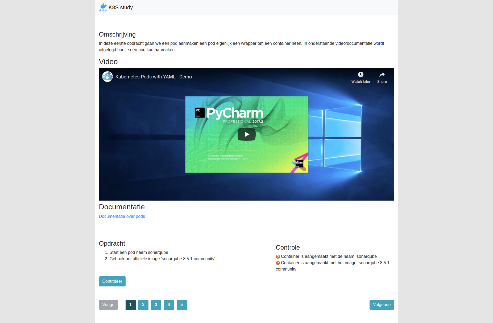

## Kubernetes study basics

# Still work in progress

In deze opdracht gaan we de basis leren over kubernetes. We beginnen met 5 eenvoudige opdrachten.

1. We gaan een sonarqube pod aanmaken en starten in kubernetes.
2. We gaan sonarqube beschikbaar maken van buiten af.
3. We gaan een persistent volume aanmaken waar we de data van sonarqube op kunnen opslaan.
4. We gaan een persistent volume claim aanmaken om een stukje storage van de persistent volume te kunnen opslaan.
5. We gaan het volume koppelen aan de sonarqube pod.

Open de tab K8sStudy en start met de opdrachten.
De opdrachten dienen in de terminal gemaakt te worden

